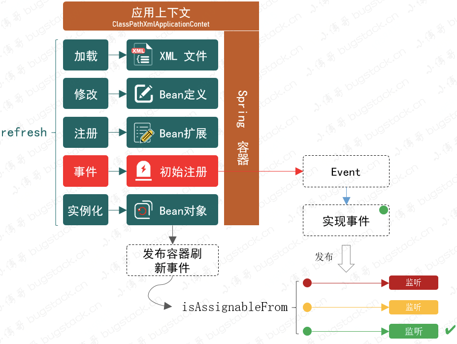

# mini-spring

学习spring源码，写一个mini的spring

## spring ioc

### spring中bean的作用域
- singleton 单例
- prototype 多例
- request 在每个Http请求中创建一个单例对象，每个请求中复用一个单例对象
- session 在每个session中有一个bean的实例，每个session中复用一个单例对象
- global-session

bean默认一个单例模式，singleton，是在一个bean的单例池(hashmap)中维护，生命周期是和ioc一致。
当把bean声明为多例模式时，每次调用就会创建一个新的，从BeanDefinitions里面取到bean属性，然后去创建。

### bean的生命周期
1. 在xml文件中配置，classLoader就会去读取xml的文件，进行解析
2. 把所有的配置变成BeanDefinition
3. BeanFactoryPostProcessor，在BeanDefinition创建后，但bean没有实例化之前，进行修改BeanDefinition的一些属性
4. bean实例化，对于单例模式从BeanDefinition获取class消息，利用反射机制，默认是采用的无惨构造方法进行创建，再去进行属性的填充，@Value这种，或者说bean依赖bean时，就会递归地去创建bean实例
5. 执行初始化方法，不过有些bean会有BeanPostProcessor，主要是在bean执行初始化之前和之后进行处理，
6. 使用
7. 摧毁，只会摧毁单例模式，摧毁其实就是在BeanDefinitions和单例池中删去

### BeanFactory和FactoryBean
1. BeanFactory是ioc的顶层规范，为spring的容器定义了一些接口，比如getbean这样的方法从容器中获取bean的实例。
2. BeanFactory在产生bead的同时，还提供了解决bean之间的依赖注入的能力，就是DI
他的一些实现类就实现他的接口，感觉不同的场景，比如xml配置，注解，去实现ioc的bean管理

FactoryBean，其实是一个工厂bean，我们可以自定义一个bean，并且加载到ioc中，主要是用来创建自定义bean的一种方式，一般用于那些复杂的bean的创建
他里面有个getobject方法，可以实现自定义的bean的创建，因为在beanfactory的getbean方法里面，实现是当我从单例池中拿出来后，再去判断这个类型是不是factoryBean，如果是的话，那么用getObject返回的值进行返回了。

### BeanFactory和ApplicationContext
ApplicationContext其实就是一个BeanFactory，因为他implement了BeanFactory， 然后他的那些bean管理能力就是由BeanFactory的实现类去实现的。
同时，ApplicationContext也implement了其他的接口，比如说classloader，他的一个bean资源加载能力也是由classloader的实现类去支持的
在他的refresh方法里面，去实现bean的整个生命周期

### spring的循环依赖
TODO:听说是用三级缓存去实现的

### spring中单例bean是线程安全吗？
spring中的bean是否线程安全，和spring容器是无关的，spring容器只是提供了bean管理的能力，

哪些bean会存在线程安全？ 
bean有两类：无状态和有状态
无状态的bean是指只会对其成员变量进行查询，不会修改
有状态的bean是指会对其的成员变量进行修改。
那么有状态的单例bean会存在线程安全的问题

解决方法：
1. 将singleton改成prototype，因为对于多例来说，每次获取都会new一个，是不存在多个线程共享的情况的。
2. 避免定义可变的成员变量
3. 可变成员变量保存在ThreadLocal中。因为threadlocal存在线程隔离的特性。

### ioc中用到的设计模式
1. 最简单的BeanFactory是简单工厂模式
2. 工厂方法：factoryBean，spring在getBean时，会判断类是不是factoryBean类型，是的话就会调用getObject方法，而不是从BeanDefinition里面获取bean了
3. 单例模式：bean的模式方式是单例模式
4. 策略模式:在ApplicationContext里面获取resource的资源时，针对不同的资源类型采取了不同的访问策略。
5. 观察者模式：spring的事件机制

### spring的事件机制是什么

## spring aop

### 动态代理
代理模式有静态代理和动态代理

spring中的动态代理有JDK动态代理和CGLIB动态代理
JDK动态代理是利用反射机制
CGLIB动态代理是利用字节码

